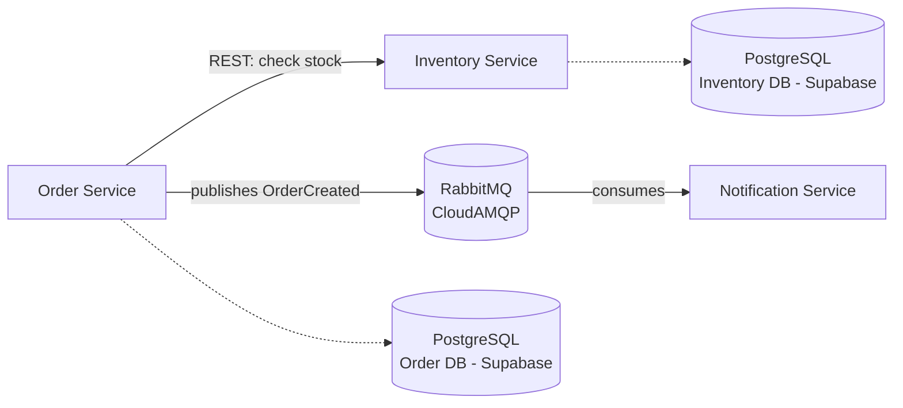

# Stockora

**Stockora** is a cloud-native e-commerce order & inventory management platform built with a microservices architecture. It's a portfolio project demonstrating backend engineering and DevOps practices end-to-end — from service design through async messaging, testing, containerization, and CI/CD.

## 🌐 Live Demo

Deployed on AWS EC2 (Terraform-provisioned) — try it yourself:

- **Inventory Service**: http://51.21.45.93:8080/products
- **Order Service**: http://51.21.45.93:8081/orders
- **Notification Service**: http://51.21.45.93:8082/actuator/health

*(Note: this is a portfolio demo instance — may be stopped periodically to manage AWS costs)*

## 🏗️ Architecture

Stockora is composed of three independently deployable Spring Boot microservices, each owning its own data, communicating via both synchronous REST calls and asynchronous event messaging.



Order Service and Inventory Service each have their own separate PostgreSQL database — true database-per-service pattern.

## 🧰 Tech Stack

| Layer | Technology |
|---|---|
| Language / Framework | Java 21, Spring Boot 4 (Jackson 3) |
| Database | PostgreSQL, hosted on Supabase (one instance per service) |
| Messaging | RabbitMQ, hosted on CloudAMQP |
| Containerization | Docker (multi-stage builds, all services) |
| CI/CD | GitHub Actions (independent pipeline per service) |
| Testing | JUnit 5, Mockito, Testcontainers |
| Cloud Deployment | AWS EC2 (Terraform-provisioned), Elastic IP |
| Monitoring | Spring Boot Actuator, Prometheus (always-on), Grafana (on-demand) |

## 📦 Services

### [`inventory-service`](./services/inventory-service)
Manages product inventory — stock levels and product catalog.

**Status:** ✅ Complete — CRUD API, unit + Testcontainers integration tests, Dockerized, CI.

| Endpoint | Method | Description |
|---|---|---|
| `/products` | GET | List all products |
| `/products/{id}` | GET | Get a single product |
| `/products` | POST | Create a new product |
| `/products/{id}/stock` | PUT | Update stock quantity |
| `/products/{id}` | DELETE | Delete a product |

### [`order-service`](./services/order-service)
Handles order creation. Calls Inventory Service synchronously to check stock, then publishes an `OrderCreated` event to RabbitMQ regardless of outcome (confirmed or rejected).

**Status:** ✅ Complete — CRUD API, inter-service REST calls, event publishing, unit tests, Dockerized, CI.

| Endpoint | Method | Description |
|---|---|---|
| `/orders` | GET | List all orders |
| `/orders/{id}` | GET | Get a single order |
| `/orders` | POST | Create an order (checks stock via Inventory Service) |

### [`notification-service`](./services/notification-service)
Consumes `OrderCreated` events from RabbitMQ and logs a simulated notification (confirmation or rejection).

**Status:** ✅ Complete — event consumer, Dockerized, CI.

## ✅ Engineering Practices Demonstrated

- **Microservices architecture** — independent services, database-per-service pattern
- **Synchronous + asynchronous communication** — REST between Order and Inventory; event-driven messaging (RabbitMQ) between Order and Notification
- **Test pyramid** — fast unit tests (Mockito) + real integration tests (Testcontainers spinning up actual Postgres containers)
- **CI/CD** — independent GitHub Actions pipeline per service, triggered only by relevant changes
- **Containerization** — multi-stage Dockerfiles for small, production-ready images, consistent across all services
- **Cloud-native development** — built entirely in GitHub Codespaces, connected to managed cloud services (Supabase, CloudAMQP) — zero local infrastructure

## 🔄 CI/CD

Every push to `master` automatically:
1. Builds and tests the affected service
2. Builds a Docker image and pushes it to Docker Hub
3. Deploys the updated container to the live EC2 instance via SSH

No manual deployment steps required.

## 📊 Monitoring

Prometheus collects metrics continuously from all three services via `/actuator/prometheus` endpoints. Grafana is available for visualization but run on-demand rather than 24/7, due to memory constraints on the free-tier EC2 instance (`t3.micro`, 1GB RAM) — a deliberate resource tradeoff to keep the core services stable.

**To view dashboards:** SSH into the server and run `docker compose up -d grafana`, then visit `http://<EC2_IP>:3000`. Since Prometheus runs continuously, historical metrics are available immediately once Grafana starts.

A saved dashboard ("Stockora Services Overview") shows JVM heap memory across all three services.

## 🚀 Running Locally

Each service has its own README with detailed setup instructions. Quick start (requires all three running together for the full flow):

```bash
# Terminal 1 - Inventory Service (port 8080)
cd services/inventory-service
export DB_HOST=... DB_PORT=5432 DB_NAME=postgres DB_USER=... DB_PASSWORD=...
./mvnw spring-boot:run

# Terminal 2 - Order Service (port 8081)
cd services/order-service
export DB_HOST=... DB_PORT=5432 DB_NAME=postgres DB_USER=... DB_PASSWORD=...
export RABBITMQ_HOST=... RABBITMQ_USERNAME=... RABBITMQ_PASSWORD=... RABBITMQ_VHOST=...
./mvnw spring-boot:run

# Terminal 3 - Notification Service (port 8082)
cd services/notification-service
export RABBITMQ_HOST=... RABBITMQ_USERNAME=... RABBITMQ_PASSWORD=... RABBITMQ_VHOST=...
./mvnw spring-boot:run
```

## 🗺️ Roadmap

- [x] Inventory Service — CRUD API
- [x] Order Service — CRUD API + inter-service REST call
- [x] Dockerize all services
- [x] CI pipelines (unit + integration tests) for all services
- [x] RabbitMQ event-driven messaging (Order → Notification)
- [x] Notification Service
- [ ] CD — auto-publish Docker images to GitHub Container Registry
- [ ] Deploy to cloud (Terraform + VM/ECS)
- [ ] Monitoring dashboard (Prometheus + Grafana)

## 📄 License

MIT